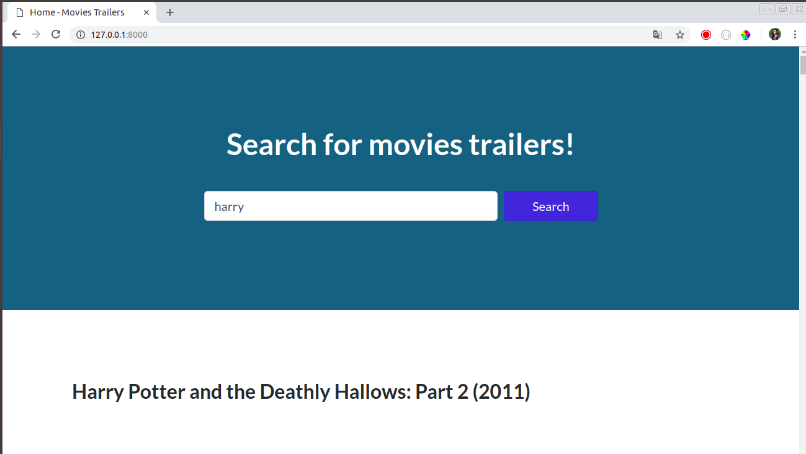

# Movies Trailers Website #

Website to search for movies trailers using its own API.
This API retrieves data from movies and its trailers from the aggregation of 
the results by calling the API of OMDb and the Youtube API. 

(Go to the bottom for more details.)

### Clonation of repository ###
$ git clone https://antobarbero@bitbucket.org/antobarbero/trailers-website.git

________________________________________________________________________


### How do I get set up? ###

Just run the following command for setup (Tested on Ubuntu 17.10)

```
$ sh setup_project.sh
```
* It will create a virtual environment, install the requirements and run the migrations.


#### Or manually follow these steps: ####


1 . install python and python venv

```
$ sudo apt-get update

$ sudo apt-get install python3.6 -y

$ sudo apt-get install python3-venv -y

```

2 . create a virtual environment and activate it.

```
$ python3 -m venv .env

$ . .env/bin/activate
```


3 . install the project requirements (with the virtual environment activated)

```
$ pip install -r requirements.txt
```

4 . Run the database migrations

```
$ ./movies_trailers/manage.py migrate
```

________________________________________________________________________

### Activate python virtual environment ###

```
$ . .env/bin/activate
```
________________________________________________________________________

### Run the server ###

```
$ ./movies_trailers/manage.py runserver
```
________________________________________________________________________

### How to run tests ###
```
$ ./movies_trailers/manage.py test movies_trailers
```

________________________________________________________________________

### Used libraries and frameworks ###

* Django==2.1.1
* django-rest-framework==0.1.0
* django-widget-tweaks==1.4.3
* google-api-python-client==1.7.4
* requests==2.19.1

________________________________________________________________________

### Screenshots ###

##### Website #####





##### API #####


